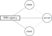

# Yo Broadcast System

## Lab description

In this assignment your task is to implement a very simple messaging app.
It is a variant of the popular service [Yo](https://en.wikipedia.org/wiki/Yo_(app)).
In Yo, users can only send *Yo messages* to each other.
If a user Alice, sends a Yo message to another user Bob, Bob's app produces the following [sound](https://gist.githubusercontent.com/laiso/8c1f11ac966c9a31cf71/raw/e1d20c71c66ce9a2c94ca501e2d2b2839f676cca/yo.mp3).

Concretely, your task will be to implement a Yo broadcasting system.
The system is composed by the following elements:

* **Yo Server**. The Yo server contains a list of registered users.
  Moreover, users may make send Yo broadcast requests to the server.
  When the server receives a Yo broadcast request, it broadcast a Yo message to all registered users.

* **Yo Clients**. Yo clients can send registration request to the server. After
  being registered, they can send Yo broadcast messages. Moreover, they need to be able to receive Yo messages from the server. When a Yo message is received the clients must play the [Yo sound](https://gist.githubusercontent.com/laiso/8c1f11ac966c9a31cf71/raw/e1d20c71c66ce9a2c94ca501e2d2b2839f676cca/yo.mp3).

**The communication between server and clients must be implemented using Java
RMI.** That is, there should be remote interfaces to implement the server
methods that client must invoke, and, similarly, the clients must provide
interfaces for the Yo broadcast messages emitted by the server.

## Architecture

The figure below shows the architecture that your application must implement.



Your task is to define remote interfaces for and implement the server and clients.

In what follows we define the constrains and requirements of each of the components in the system.

### Communication constraints

The arrows in the figure above define the allowed communications between the components in the system.

* The server cannot download remote objects from the RMI registry. It can only upload a remote reference of itself to the RMI registry.

* Clients can only download remote objects from the server. Hence, they cannot upload references of themselves.

* Communication between clients and server can be done through any remaining Java RMI operations.

### Server Requirements

Here we list the minimum functionality that your server must implement:

* **Client registration**. Clients must be able to register in the server. Moreover, the server must keep track of all connected clients.
* **Yo broadcasting**. The server must offer clients the possibility to send Yo broadcast requests.


### Clients Requirements

Here we list the minimum functionality that your clients must implement:

* **Handle Yo messages**. Clients must be able to receive a "Yo message" from the server. Receiving this message will result in having the client playing the Yo sound.

## Code Skeleton

We provide you with a very simple Graphical User Interface (GUI) for Yo clients. The GUI looks as follows.


The interface provides a user-friendly way to register and send Yo messages.
You can extend this file and add any other Java files (e.g., server or
interfaces) that your application requires.

The only part of the code in `Yo.java` that you need to modify is the method `Java actionPerformed(ActionEvent e)`. Inside this method there is an `if` statement that handle the cases when you press:

* The Register in Yo Server button:

  ```Java
  if ("register".equals(e.getActionCommand())) {
    // TODO: Connect to the Yo server
    // Your code here...

    b2.setEnabled(true); // Enable sending Yo after registering
    b1.setEnabled(false); // Disable registering Yo after registering
    l1.setText("Registered!"); // Informing that registration was successfull
  ```

  Note that this snippet also shows how to handle the elements of the GUI: `b1` (register button), `b2` (send Yo button) and `l1` (text next to send Yo button).

* The Send Yo button:

  ```Java
  } else if ("send-yo".equals(e.getActionCommand())) {
    // TODO: Send a broadcast Yo request to the server
    // Your code here...

  }
  ```

In order to play the Yo sound we provide you with the function `playYo()`. This function simply plays the audio file `yo.wav` in the skeleton.

### Running the code

You can run the code of the skeleton by simply using `javac` and `java` commands.

```bash
$ javac Yo.java
$ java Yo
```

If you would like to execute more than one instance of the client, open a new terminal in the same directory and run again `java Yo`.

Note that if you add more files to the projects the must be compiled as well. In such a case, you can use the command `javac *.java` to compile of the java files in the directory. Moreover, when you application is finish you will need to start a RMI registry `rmiregistry` and the server in different terminals.
